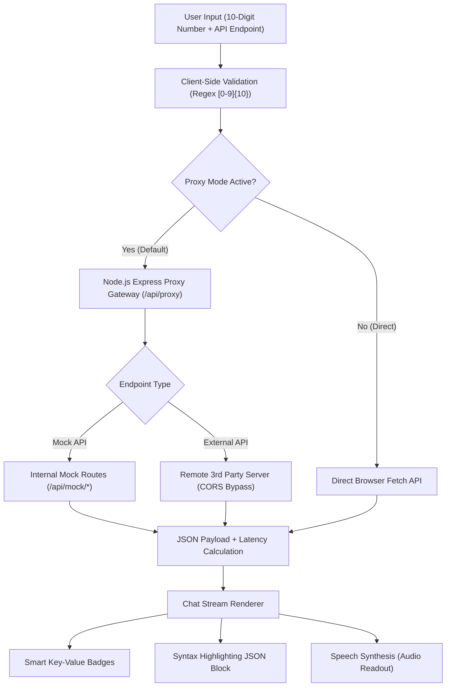

# 🎓 APIChat Hub - 10-Digit Query & API Chatbox Interface

> **College Project Submission**  
> **Course / Degree:** B.Tech / B.E. / BCA / MCA / B.Sc Computer Science  
> **Domain:** Full-Stack Web Development, RESTful Architecture, API Middleware & UI/UX Design

---

## 📖 1. Project Abstract

**APIChat Hub** is an interactive web-based software system that bridges arbitrary REST APIs with a conversational chatbox interface. The user provides any target API endpoint (custom third-party, enterprise, or internal mock) and a **10-digit numerical identifier** (such as a telephone number, roll number, tracking ID, or transaction sequence). 

The application incorporates a server-side **CORS Proxy Gateway**, high-precision input sanitization, roundtrip latency measurement, structured JSON parsing, and a responsive glassmorphic chatbox with Text-to-Speech (TTS) auditory narration.

---

## 🌟 2. Key Features

- **Custom API Endpoint Freedom & Lock API Security:**
  - Enter any external REST API (GET / POST / PUT).
  - Supports query parameters (e.g. `?number=XXXXXXXXXX`) or REST path tokens (`https://api.example.com/lookup/{number}`).
  - Custom header injection (Authorization Bearer Token, API Key headers, custom tokens).
  - 🔒 **Lock API Feature:** One-click lock prevents accidental modifications, freezes endpoints, disables input fields, persists across browser sessions in `localStorage`, and prevents unauthorized Telegram bot commands from overriding the target API.
- **Strict 10-Digit Number Validation:**
  - Real-time digit counter badge (`0/10` to `10/10`).
  - Auto-sanitizes non-numeric characters on typing or pasting.
  - Interactive quick-test chips (`9876543210`, `9123456789`, etc.) for 1-click evaluation.
- **Server-Side CORS Proxy Gateway:**
  - Bypasses browser Same-Origin Policy (SOP) limitations that typically cause cross-origin fetch failures in frontend-only apps.
  - Incorporates an `AbortController` 15-second timeout safeguard.
- **Modern Conversational Chat Stream:**
  - **User Bubbles:** Displays sent 10-digit number, target endpoint, and timestamp.
  - **Bot Bubbles:** Displays HTTP Status Code (`200 OK`, `404`, `502`), latency in milliseconds (`⚡ 85 ms`), and smart summary highlight cards.
  - **Interactive Syntax-Highlighted JSON:** Color-coded keys, values, booleans, and nulls with a "Copy to Clipboard" button.
- **Presentation "Wow Factor" Features:**
  - 🤖 **Telegram Bot Mobile Integration:** Connect any Telegram bot in 30 seconds. Query 10-digit numbers directly from Telegram mobile app with real-time SSE synchronization to the web dashboard!
  - 👑 **Role-Based Access Control (RBAC) & Bot Owner:** Telegram User ID `2051992452` is the designated Bot Owner. Normal users are blocked until authorized by the owner, who can assign custom query quotas (`/auth <id> [limit]`), replenish quotas (`/setlimit <id> <limit>`), or revoke access (`/deauth <id>`).
  - 🔊 **Web Speech API (Text-to-Speech):** Reads out the key response metrics audibly.
  - 🎵 **Synthesized Sound Effects:** Subtly chimes on message send/receive via Web Audio API.
  - 🌓 **Dark / Light Theme:** Toggleable and persisted via `localStorage`.
  - 💾 **Export Chat History:** One-click JSON export for lab reports.
  - 🧪 **3 Built-in Mock APIs:** Telecom carrier lookup, University Student KYC registry, and SMS/OTP delivery simulation (works 100% offline without needing paid API keys).

---

## 🏗️ 3. System Architecture



---

## 🛠️ 4. Tech Stack

| Layer | Technologies Used |
| :--- | :--- |
| **Frontend** | HTML5, CSS3 (Modern Glassmorphism & Custom Properties), Vanilla JavaScript (ES6+), Web Audio API, Web Speech API |
| **Backend** | Node.js (v18+ or v24), Express.js framework |
| **Networking** | RESTful HTTP, CORS middleware, Node.js native `fetch` with `AbortController` |
| **Styling & Fonts** | Google Fonts (*Plus Jakarta Sans* & *Fira Code*), responsive flexbox and CSS grid |

---

## 🚀 5. How to Run Locally

### Prerequisites
- Node.js installed (v18 or higher recommended). Check with `node -v`.

### Installation Steps

1. **Navigate to the project folder:**
   ```bash
   cd "C:\Users\DELL\.gemini\antigravity\scratch\api-number-chat-hub"
   ```

2. **Install dependencies:**
   ```bash
   npm install
   ```

3. **Start the application:**
   ```bash
   npm start
   ```

4. **Open in your web browser:**
   Open [http://localhost:3000](http://localhost:3000)

---

## 🧪 6. Testing & Demonstration Guide for Evaluator / Viva

When showing this project to your professor or examiner:

1. **Demo 1: Telecom & Carrier Lookup (Built-in Demo)**
   - Select **"Telecom & Carrier Lookup"** from the Preset dropdown.
   - Click the sample chip `9876543210` or type any 10-digit number.
   - Click **Send Query** (or press `Enter`).
   - *Observation:* The chat stream will show the 10-digit query, latency (e.g., `⚡ 12 ms`), carrier name (*Airtel 5G / Jio / BSNL*), circle location, spam score, and color-coded JSON. Click **"Speak Output"** to demo audio readout!

2. **Demo 2: University Student Registry (College context demo)**
   - Select **"University Student Registry"** from the Preset dropdown.
   - Type any 10-digit number (e.g. `9123456789`).
   - Click **Send Query**.
   - *Observation:* Generates student profile, roll number, semester, CGPA, and project approval status.

3. **Demo 3: Custom Third-Party API**
   - Select **"Custom API"** or keep Custom URL.
   - Enter `https://httpbin.org/get` in the API URL field.
   - Enter `phone` or `number` in the Query Param field.
   - Type `8800112233` and click **Send Query**.
   - *Observation:* Shows real-time remote fetch through the backend proxy.

4. **Demo 4: Validation Edge Cases**
   - Try typing fewer than 10 digits (e.g., `98765`) -> Notice the digit counter turns amber (`5/10`) and tells the user how many digits are missing.
   - Try typing alphabets or special characters -> Automatically sanitized.

---

## 🎯 7. Viva / Examiner Q&A Guide

**Q1: What problem does the CORS proxy solve?**  
*Answer:* Browsers strictly enforce the **Same-Origin Policy (SOP)**. When a web application running at `http://localhost:3000` attempts to query a third-party API (like `https://api.external.com`), the browser checks for an `Access-Control-Allow-Origin` response header. If that header is missing or restricted, the browser blocks the response. Our Node.js Express server acts as a proxy: server-to-server requests are not restricted by browser CORS, allowing our backend to fetch the data and deliver it securely to the client.

**Q2: What is the purpose of using `AbortController` in `server.js`?**  
*Answer:* External servers may hang, drop packets, or experience high latency. An `AbortController` cancels the request after 15 seconds, preventing server thread lock and resource exhaustion.

**Q3: How does the chatbox highlight JSON syntax?**  
*Answer:* The client uses a regular-expression tokenizer in `app.js` to distinguish between JSON keys, string literals, numerical values, booleans, and null values, wrapping each in semantic CSS classes (`.json-key`, `.json-string`, `.json-number`, `.json-boolean`).

---

## 📂 8. Project File Structure

```
api-number-chat-hub/
├── package.json          # Node dependencies & start scripts
├── server.js             # Express backend, CORS proxy & mock API routes
├── README.md             # Complete project documentation & viva guide
└── public/               # Frontend static assets
    ├── index.html        # Semantic HTML layout, sidebar & chatbox
    ├── style.css         # Glassmorphic dark/light styling & animations
    └── app.js            # Client-side logic, regex validation & Web APIs
```
